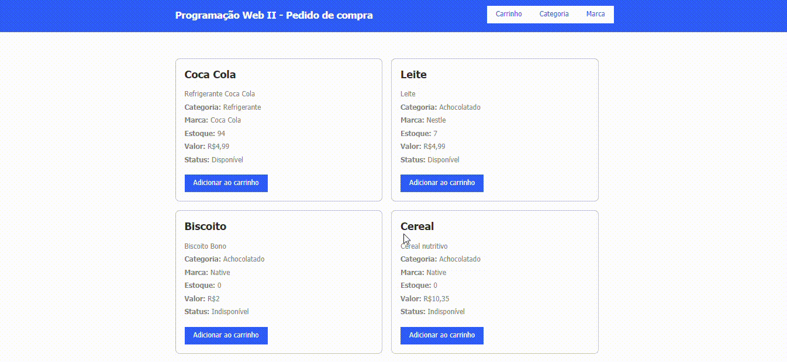
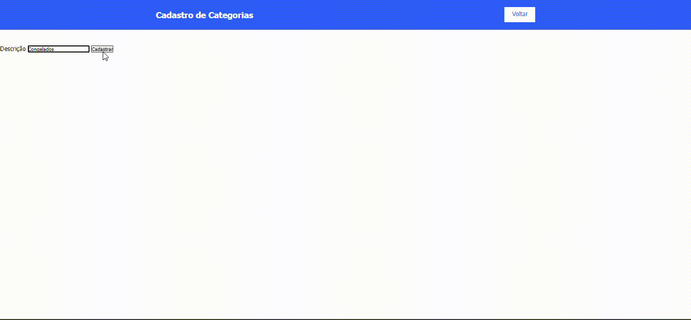
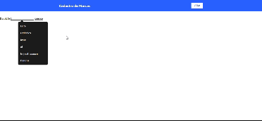

# 💻 Siistema de Gerenciamento de Produtos

### Este projeto, denominado "Sistema de Cadastro de Produtos", é uma aplicação web que facilita a gestão de produtos em um banco de dados relacional. Abaixo estão as funcionalidades e propósitos detalhados do projeto:

<br>
------------------------------------------------------------------------------------------------------------------

<br>

## ⚙️ Funcionalidade

### 1. Cadastro e Gerenciamento de Categorias
<p>

    Permite a criação de categorias de produtos, como "Laticínios", "Bebidas", "Frios", etc.

    Facilita a organização dos produtos, agrupando-os em categorias específicas.

</p>

### 2. Cadastro e Gerenciamento de Marca
<p>

    Permite a inclusão de diferentes marcas de produtos, como "Nestlé", "Coca-Cola", 

    Auxilia na identificação e categorização dos produtos conforme suas marcas.

</p>

### 3. Cadastro e Gerenciamento de Produtos
<p>

    --> Permite o registro detalhado de produtos, incluindo:
            -> Nome do Produto: Ex. "Leite Condensado"
            -> Descrição do Produto: Ex. "Leite condensado integral de 395g"
            -> Quantidade em Estoque: Ex. "100 unidades"
            -> Preço do Produto: Ex. "R$ 4,50"
            -> Categoria: Ex. "Laticínios"
    --> Facilita a adição de novos produtos ao inventário da loja.

</p>

### 4. Vizualização de Produtos Cadastrados
<p>

    Permite a visualização de todos os produtos cadastrados na pagina principal.

</p>

### 5. Vizualização de Produtos no Carrinho
<p>

    Permite a visualização de todos os produtos cadastrados na pagina principal.

</p>

# Banco de Dados

### Criar Database
``` sql
    CREATA DATABASE `compra`;
```

### Categoria
``` sql
    CREATE TABLE `categoria` (
    `IDCATEGORIA` int(11) NOT NULL AUTO_INCREMENT,
    `DESCRICAO` varchar(255) NOT NULL,
    PRIMARY KEY (`IDCATEGORIA`)
  ) ENGINE=InnoDB AUTO_INCREMENT=0 DEFAULT CHARSET=latin1 COLLATE=latin1_swedish_ci;
```

### Marca
``` sql
    CREATE TABLE `marca` (
    `IDMARCA` int(11) NOT NULL AUTO_INCREMENT,
    `DESCRICAO` varchar(255) NOT NULL,
    PRIMARY KEY (`IDMARCA`)
  ) ENGINE=InnoDB AUTO_INCREMENT=0 DEFAULT CHARSET=latin1 COLLATE=latin1_swedish_ci;
```


### Produtos
``` sql
    CREATE TABLE `produtos` (
    `IDPRODUTO` int(11) NOT NULL AUTO_INCREMENT,
    `NOME` varchar(255) NOT NULL,
    `DESCRICAO` text NOT NULL,
    `ESTOQUE` int(11) NOT NULL,
    `PRECO` decimal(10,2) NOT NULL,
    `IDCATEGORIA` int(11) NOT NULL,
    `IDMARCA` int(11) NOT NULL,
    PRIMARY KEY (`IDPRODUTO`),
    FOREIGN KEY (`IDCATEGORIA`) REFERENCES `categoria`(`IDCATEGORIA`),
    FOREIGN KEY (`IDMARCA`) REFERENCES `marca`(`IDMARCA`)
  ) ENGINE=InnoDB AUTO_INCREMENT=0 DEFAULT CHARSET=latin1 COLLATE=latin1_swedish_ci;
```

# Na prática

## Pagina Principal
``` sql
SELECT * FROM `compra`.`produtos`;
```


## Cadastro de Categoria
``` sql
SELECT * FROM `compra`.`categoria`;
```


## Cadastro de Marca
``` sql
SELECT * FROM `compra`.`marca`;
```


----------------------------------------------------------------------------------------------------------------------

## Tecnologias Utilizadas
| Tecnologia | Tipo |
|------------|------|
|    HTML5   | Marcação |
|    CSS3    | Estilização |
|    PHP     | Progrmação 8.0.30 |
|   JQuery   | Biblioteca |
|    MySQL   | Banco de Dados |
|   Apache / Xampp | Servidor Local |


### Instalação do Projeto

**Clone o Repositório**

``` bash
  git clone https://github.com/joaovictorgit21/CadEcommerce
  cd CadEcommerce
```


----------------------------------------------------------------------------------------------------------------------

# 👨‍💻 Programador

| [<br><sub>João Victor Farias</sub>](https://github.com/joaovictorgit21)
| :--: |

# 👨‍🏫 Orientador 

| [<br><sub>Leonardo Rocha</sub>](https://github.com/LeonardoRochaMarista)
| :---: |