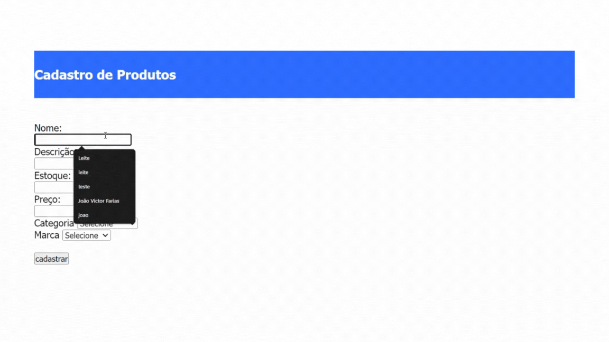
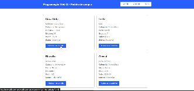

# 💻 Siistema de Gerenciamento de Produtos

### Este projeto, denominado "Sistema de Cadastro de Produtos", é uma aplicação web que facilita a gestão de produtos em um banco de dados relacional. Abaixo estão as funcionalidades e propósitos detalhados do projeto:

<br>
------------------------------------------------------------------------------------------------------------------

<br>

## ⚙️ Funcionalidade

### 1. Cadastro e Gerenciamento de Categorias
<p>

    Permite a criação de categorias de produtos, como "Laticínios", "Bebidas", "Frios", etc.

    Facilita a organização dos produtos, agrupando-os em categorias específicas.

</p>

### 2. Cadastro e Gerenciamento de Marca
<p>

    Permite a inclusão de diferentes marcas de produtos, como "Nestlé", "Coca-Cola", 

    Auxilia na identificação e categorização dos produtos conforme suas marcas.

</p>

### 3. Cadastro e Gerenciamento de Produtos
<p>

    --> Permite o registro detalhado de produtos, incluindo:
            -> Nome do Produto: Ex. "Leite Condensado"
            -> Descrição do Produto: Ex. "Leite condensado integral de 395g"
            -> Quantidade em Estoque: Ex. "100 unidades"
            -> Preço do Produto: Ex. "R$ 4,50"
            -> Categoria: Ex. "Laticínios"
    --> Facilita a adição de novos produtos ao inventário da loja.

</p>

### 4. Vizualização de Produtos Cadastrados
<p>

    Permite a visualização de todos os produtos cadastrados na pagina principal.

</p>

### 5. Vizualização de Produtos no Carrinho
<p>

    Permite a visualização de todos os produtos cadastrados na pagina principal.

</p>

# Banco de Dados

### Criar Database
``` sql
    CREATE DATABASE `compra`;
```

### Categoria
``` sql
    CREATE TABLE `categoria` (
    `IDCATEGORIA` int(11) NOT NULL AUTO_INCREMENT,
    `DESCRICAO` varchar(255) NOT NULL,
    PRIMARY KEY (`IDCATEGORIA`)
  ) ENGINE=InnoDB AUTO_INCREMENT=0 DEFAULT CHARSET=latin1 COLLATE=latin1_swedish_ci;
```

### Marca
``` sql
    CREATE TABLE `marca` (
    `IDMARCA` int(11) NOT NULL AUTO_INCREMENT,
    `DESCRICAO` varchar(255) NOT NULL,
    PRIMARY KEY (`IDMARCA`)
  ) ENGINE=InnoDB AUTO_INCREMENT=0 DEFAULT CHARSET=latin1 COLLATE=latin1_swedish_ci;
```


### Produtos
``` sql
    CREATE TABLE `produtos` (
    `IDPRODUTO` int(11) NOT NULL AUTO_INCREMENT,
    `NOME` varchar(255) NOT NULL,
    `DESCRICAO` text NOT NULL,
    `ESTOQUE` int(11) NOT NULL,
    `PRECO` decimal(10,2) NOT NULL,
    `IDCATEGORIA` int(11) NOT NULL,
    `IDMARCA` int(11) NOT NULL,
    PRIMARY KEY (`IDPRODUTO`),
    FOREIGN KEY (`IDCATEGORIA`) REFERENCES `categoria`(`IDCATEGORIA`),
    FOREIGN KEY (`IDMARCA`) REFERENCES `marca`(`IDMARCA`)
  ) ENGINE=InnoDB AUTO_INCREMENT=0 DEFAULT CHARSET=latin1 COLLATE=latin1_swedish_ci;
```

# Funcionamento

## Pagina Principal
``` sql
SELECT * FROM `compra`.`produtos`;
```


## Cadastro de Categoria
``` sql
SELECT * FROM `compra`.`categoria`;
```


## Cadastro de Marca
``` sql
SELECT * FROM `compra`.`marca`;
```


## Cadastrar Produto
``` sql
SELECT * FROM `compra`.`produtos`;
```


## Carrinho



----------------------------------------------------------------------------------------------------------------------

## Tecnologias Utilizadas
| Tecnologia | Tipo |
|------------|------|
|    HTML5   | Marcação |
|    CSS3    | Estilização |
|    PHP     | Progrmação 8.0.30 |
|   JQuery   | Biblioteca |
|    MySQL   | Banco de Dados |
|   Apache / Xampp | Servidor Local |

---------------------------------------------------------------------------------------------------------------------
### Instalação do Projeto

**Clone o Repositório**

``` bash
  git clone https://github.com/joaovictorgit21/CadEcommerce
  cd CadEcommerce
```

----------------------------------------------------------------------------------------------------------------------
<br>

## **Descrição dos Metódos Utilizados:**

| Método                    | Descrição                                                                                       | Exemplo |
| ------------------------- | -------------------------------------------------------------------------------------------------| ------- |
| [**include_once()**](https://www.php.net/manual/pt_BR/function.include-once.php)        | Inclui e avalia o arquivo especificado durante a execução do script, garantindo que ele só seja incluído uma vez. | `include_once('config.php');` |
| [**mysqli_query()**](https://www.php.net/manual/pt_BR/mysqli.query.php)        | Executa uma consulta no banco de dados MySQL.                                                    | `$result = mysqli_query($conn, "SELECT * FROM users");` |
| [**while**](https://www.php.net/manual/pt_BR/control-structures.while.php)                 | Estrutura de repetição que executa um bloco de código enquanto a condição for verdadeira.         | `while ($row = mysqli_fetch_assoc($result)) { echo $row['name']; }` |
| [**mysqli_fetch_assoc()**](https://www.php.net/manual/pt_BR/mysqli-result.fetch-assoc.php)  | Busca uma linha de resultado como uma matriz associativa.                                        | `$row = mysqli_fetch_assoc($result);` |
| [**echo**](https://www.php.net/manual/pt_BR/function.echo.php)                  | Exibe uma ou mais strings.                                                                       | `echo "Hello, World!";` |
| [**mysqli_affected_rows()**](https://www.php.net/manual/pt_BR/mysqli.affected-rows.php)| Retorna o número de linhas afetadas pela última consulta.                                        | `$affectedRows = mysqli_affected_rows($conn);` |
| [**mysqli_close()**](https://www.php.net/manual/pt_BR/mysqli.close.php)        | Fecha a conexão com o banco de dados MySQL.                                                      | `mysqli_close($conn);` |
| [**mysqli_error()**](https://www.php.net/manual/pt_BR/mysqli.error.php)        | Retorna a mensagem de erro da última operação MySQL.                                             | `echo mysqli_error($conn);` |
| [**__construct()**](https://www.php.net/manual/pt_BR/language.oop5.decon.php)         | Método construtor de uma classe, executado automaticamente na criação de um objeto.              | `class MyClass { function __construct() { echo "Constructor called"; } }` |
| [**session_start()**](https://www.php.net/manual/pt_BR/function.session-start.php)       | Inicia uma nova sessão ou resume uma sessão existente.                                           | `session_start();` |
| [**$mysqli->query**](https://www.php.net/manual/pt_BR/mysqli.query.php)        | Método orientado a objetos para executar uma consulta no banco de dados MySQL.                   | `$result = $mysqli->query("SELECT * FROM users");` |
| [**mysqli_fetch_object()**](https://www.php.net/manual/pt_BR/mysqli-result.fetch-object.php) | Busca uma linha de resultado como um objeto.                                                     | `$obj = mysqli_fetch_object($result);` |
| [**array()**](https://www.php.net/manual/pt_BR/function.array.php)               | Cria um array.                                                                                   | `$arr = array(1, 2, 3);` |
| [**$_SESSION['']**](https://www.php.net/manual/pt_BR/reserved.variables.session.php)         | Superglobal que armazena e acessa variáveis de sessão.                                           | `$_SESSION['username'] = 'admin';` |
| [**exit;**](https://www.php.net/manual/pt_BR/function.exit.php)                 | Termina a execução do script.                                                                    | `exit("Script terminated.");` |
| [**header('Location:')**](https://www.php.net/manual/pt_BR/function.header.php)   | Envia um cabeçalho HTTP de redirecionamento para o navegador.                                    | `header('Location: index.php');` |
| [**max()**](https://www.php.net/manual/pt_BR/function.max.php)                 | Retorna o valor máximo de um array ou de uma lista de argumentos.                                | `$maxValue = max(1, 2, 3);` |
| [**array_keys()**](https://www.php.net/manual/pt_BR/function.array-keys.php)          | Retorna todas as chaves de um array.                                                             | `$keys = array_keys($arr);` |
| [**str_replace()**](https://www.php.net/manual/pt_BR/function.str-replace.php)         | Substitui todas as ocorrências de uma string por outra.                                          | `$newStr = str_replace("world", "PHP", "Hello world!");` |
| [**unset()**](https://www.php.net/manual/pt_BR/function.unset.php)               | Destrói a variável especificada, liberando qualquer recurso associado.                           | `unset($var);` |
| [**new Carrinho()**](https://www.php.net/manual/pt_BR/language.oop5.basic.php)        | Cria uma nova instância da classe `Carrinho`.                                                    | `$cart = new Carrinho();` |
| [**mysqli_connect()**](https://www.php.net/manual/pt_BR/mysqli.connect.php)      | Abre uma nova conexão com um servidor MySQL.                                                     | `$conn = mysqli_connect('localhost', 'user', 'password', 'database');` |
| [**$mysqli->connect_error**](https://www.php.net/manual/pt_BR/mysqli.connect-error.php)| Propriedade que contém a mensagem de erro da última tentativa de conexão.                        | `if ($mysqli->connect_error) { die('Connect Error: ' . $mysqli->connect_error); }` |
| [**$mysqli->set_charset('utf8')**](https://www.php.net/manual/pt_BR/mysqli.set-charset.php) | Define o conjunto de caracteres da conexão MySQL para UTF-8.                                     | `$mysqli->set_charset('utf8');` |
| [**die()**](https://www.php.net/manual/pt_BR/function.die.php)                 | Termina a execução do script e opcionalmente imprime uma mensagem.                               | `die("Error: Cannot continue.");` |

----------------------------------------------------------------------------------------------------------------------

# 👨‍💻 Programador

| [<br><sub>João Victor Farias</sub>](https://github.com/joaovictorgit21)
| :--: |

# 👨‍🏫 Orientador 

| [<br><sub>Leonardo Rocha</sub>](https://github.com/LeonardoRochaMarista)
| :---: |